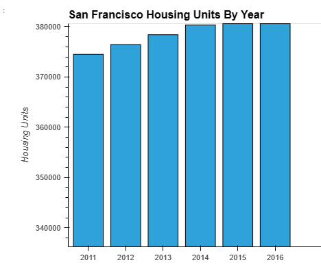
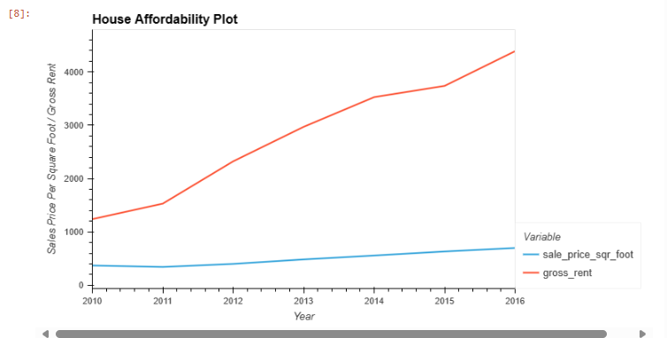
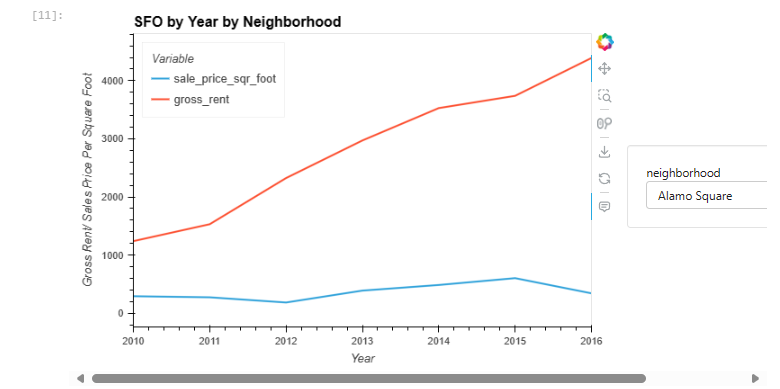
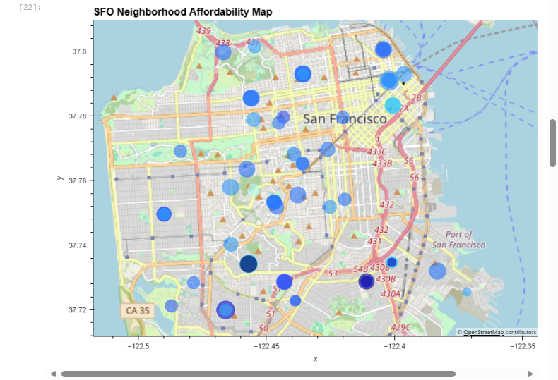

    
# Housing Market Analysis
    
##### Created by [Demi Oyebanji](mailto:oluwademiladeoyebanji@outlook.com) as an assignment for the **UofT SCS Financial Technology Bootcamp**
________________________________________________________________________________________________________

In this file, I analyze two CSVs of data about the housing market in different Bay Area neighborhoods between 2010 and 2016.

### Visualizations
I use hvplot and geoviews to visualize and analyze the data points to generate insights

The above figure showed that overall trend in Housing Units in San Francisco is RISING by an average of about 2,000 units per year

The above figure revealed that 2011 saw a slight drop in sales price from the previous year and also had a slower rise in rent increase than many of the years that followed but the rent did increase 

The figures above helped me determine:

* The neighborhood with the highest gross rent: {'Westwood Park'}
* The neighborhood with the highest sale price: {'Union Square District'}